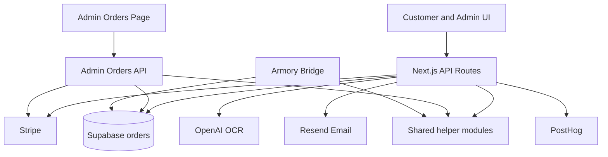
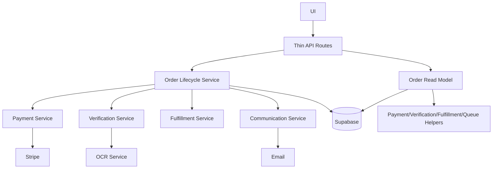
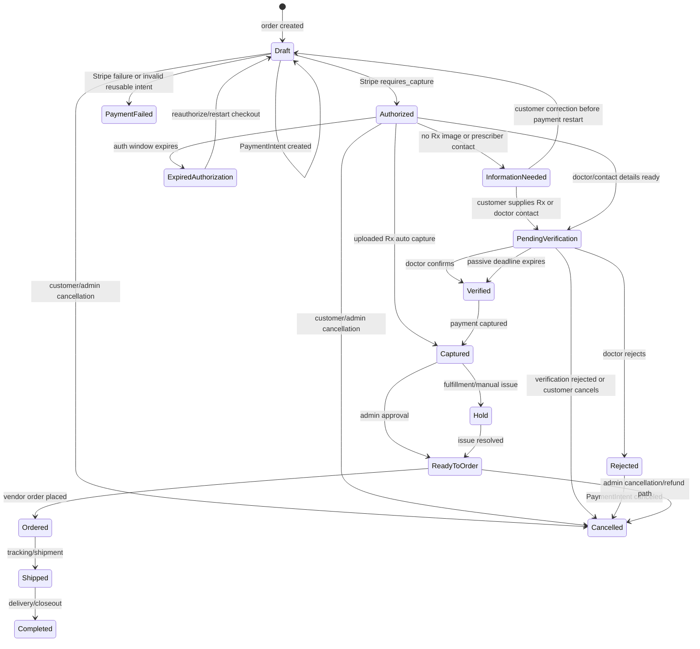
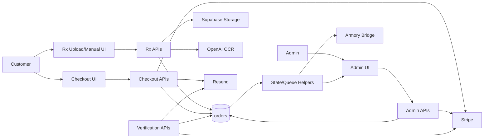
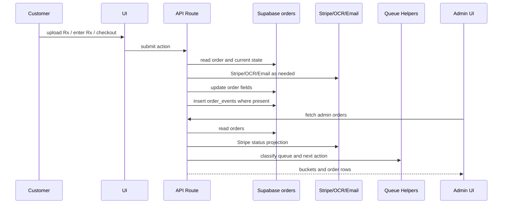

# Honest Lenses Technical Debt and Architecture Audit

Date: 2026-07-13

Scope: current local workspace for Honest Lenses order, checkout, verification,
payment, fulfillment, communication, recovery, and admin flows.

This is an architecture audit only. It does not propose a rewrite. The goal is
to reduce business-rule drift by centralizing existing rules and documenting
legal transitions while preserving current production behavior.

## Executive Summary

Honest Lenses has the right beginnings of a canonical order read model in:

- `src/lib/orders/getNextAction.ts`
- `src/lib/orders/operationalQueue.ts`
- `src/lib/orders/verificationReadiness.ts`
- `src/lib/payments/captureAmount.ts`

The main risk is that write routes still enforce their own versions of the same
business rules. Payment state, verification state, fulfillment state, Rx
evidence, customer-blocked classification, and capture readiness are each
computed in more than one place.

The safest path is incremental:

1. Lock down the highest-risk state write paths.
2. Extract pure lifecycle helpers.
3. Replace route-local conditions with those helpers.
4. Add transition tests before moving more behavior into services.

## Current Canonical Candidates

| Concern | Best current source | Current issue |
|---|---|---|
| Payment display state | `getPaymentState` in `src/lib/orders/getNextAction.ts` | Admin API and Armory also derive payment state separately. |
| Verification display state | `getVerificationState` in `src/lib/orders/getNextAction.ts` | Routes still use local `isVerifiedLike` and direct status checks. |
| Rx evidence/source | `getRxSourceState` in `src/lib/orders/getNextAction.ts` | Checkout, recovery, abandonment, feedback, and admin still have local versions. |
| Verification readiness | `src/lib/orders/verificationReadiness.ts` | Good new extraction, but not yet used everywhere that decides customer/prescriber paths. |
| Capture amount | `src/lib/payments/captureAmount.ts` | Good extraction, but capture readiness is not centralized. |
| Operational queue | `classifyOperationalQueue` in `src/lib/orders/operationalQueue.ts` | Mostly canonical for admin, but customer-blocked and archive decisions still exist elsewhere. |
| Next action | `getNextAction` in `src/lib/orders/getNextAction.ts` | Admin uses it; customer pages and some APIs still present local status messages. |
| Fulfillment state | No single exported helper | Duplicated across `getNextAction`, `operationalQueue`, admin UI, admin API, and Armory. |

## State Machine Inventory

### Payment State

Locations:

- `src/lib/orders/getNextAction.ts`
  - `normalizePaymentStatus`
  - `getPaymentState`
- `src/app/api/admin/orders/route.ts`
  - `fallbackPaymentStatus`
  - `statusFromStripeIntent`
  - `withPaymentStatus`
- `src/app/api/armory/orders/route.ts`
  - `derivePaymentStatus`
- `src/lib/orders/operationalQueue.ts`
  - `CUSTOMER_BLOCKED_STRIPE_STATUSES`
  - `isCustomerPaymentBlocked`
- `src/lib/ops/abandonedCheckout.ts`
  - `hasAuthorizedPayment`
- `src/app/order/[id]/page.tsx`
  - `formatStatus`
- Capture/write routes:
  - `src/app/api/checkout/authorized/route.ts`
  - `src/app/api/orders/[id]/capture/route.ts`
  - `src/app/api/checkout/capture/route.ts`
  - `src/app/api/verification/complete/route.ts`
  - `src/app/api/verification/process/route.ts`

Recommendation:

- Extract `src/lib/orders/paymentState.ts`.
- Move Stripe status projection and fallback order-status projection there.
- Have admin API call a single `projectPaymentState(order, stripeIntent?)`.
- Keep `getPaymentState` as a thin display wrapper over that canonical helper.

### Verification State

Locations:

- `src/lib/orders/getNextAction.ts`
  - `VERIFIED_STATUSES`
  - `REVIEW_STATUSES`
  - `getVerificationState`
- `src/lib/orders/verificationReadiness.ts`
  - readiness for `pending` versus `information_needed`
- Route-local checks:
  - `src/app/api/verification/send/route.ts` local `isVerifiedLike`
  - `src/app/api/orders/[id]/rx/route.ts` local `isVerifiedLike`
  - `src/app/api/cart/resolve/route.ts` direct `auto_verified`/`verified` gate
  - `src/app/api/orders/[id]/capture/route.ts` direct `verified`/`altered` gate
  - `src/app/api/orders/[id]/reauthorize/route.ts` direct `altered` gate
  - `src/lib/ops/orderFlags.ts` local `isVerifiedLike`
  - `src/app/order/[id]/page.tsx` local display formatting

Recommendation:

- Extract `src/lib/orders/verificationState.ts`.
- Export:
  - `normalizeVerificationState`
  - `isVerificationComplete`
  - `isVerificationRejectedOrBlocked`
  - `requiresOperatorReview`
  - `canCaptureAfterVerification`
  - `canEnterPendingVerification`
- Keep `verificationReadiness.ts` focused on information sufficiency, not display.

### Fulfillment State

Locations:

- `src/lib/orders/getNextAction.ts`
  - private `FulfillmentStatus`
  - `normalizeFulfillmentStatus`
- `src/lib/orders/operationalQueue.ts`
  - duplicate `FulfillmentStatus`
  - duplicate `normalizedFulfillmentStatus`
- `src/app/admin/orders/page.tsx`
  - `FulfillmentStatus`
  - `FULFILLMENT_STATUSES`
  - `FULFILLMENT_PROGRESS_FLOW`
  - `PAYMENT_CAPTURE_REQUIRED_FULFILLMENT_STATUSES`
  - `normalizedFulfillmentStatus`
  - `canSetFulfillmentStatus`
- `src/app/api/admin/orders/[id]/route.ts`
  - duplicate `FULFILLMENT_STATUSES`
- `src/app/api/armory/orders/route.ts`
  - `deriveShipmentStatus`
  - local known fulfillment list in flags

Recommendation:

- Extract `src/lib/orders/fulfillmentState.ts`.
- Export the allowed fulfillment statuses and transition helpers.
- Admin UI can keep labels and button text, but should import allowed statuses and payment-required status list.

### Operational Queue Classification

Locations:

- Canonical candidate:
  - `src/lib/orders/operationalQueue.ts`
- Consumers:
  - `src/app/api/admin/orders/route.ts`
  - `src/app/admin/orders/page.tsx`
  - `src/app/api/armory/orders/route.ts`
- Related but separate:
  - `src/lib/ops/abandonedCheckout.ts`
  - `src/lib/ops/orderFlags.ts`

Recommendation:

- Keep `classifyOperationalQueue` as canonical for active admin buckets.
- Decide whether abandoned checkout is a sub-classifier called by queue
  classification or remains separate. If separate, make that boundary explicit:
  "draft abandonment" versus "post-payment operations".

### Next Action

Locations:

- Canonical:
  - `src/lib/orders/getNextAction.ts`
- Consumers:
  - Admin UI
  - Operational queue
  - Armory via queue classification
- Duplicates:
  - Customer order page has separate copy by raw status.
  - Admin archive status has separate summary logic.

Recommendation:

- Keep `getNextAction` canonical.
- Add a customer-safe formatter that maps canonical next action to public-facing text.

## Duplicate Business-Rule Inventory

| Rule | Duplicate locations | Risk | Recommendation |
|---|---|---:|---|
| Payment lifecycle projection | `getNextAction`, admin API, Armory, order page, abandonment helper | P1 | Extract `paymentState.ts`; admin API may still fetch Stripe but must use shared projection. |
| Capture readiness | `/api/orders/[id]/capture`, `/api/checkout/capture`, `/api/verification/complete`, `/api/verification/process`, `/api/checkout/authorized` | P0 | Extract `captureReadiness.ts` or `paymentService.captureAuthorizedOrder`. |
| Capture amount | Mostly centralized in `getCaptureAmountCents`, but feedback route updates PI amount separately | P1 | Keep current helper, add capture-readiness helper around it. |
| Verified-like statuses | `getVerificationState`, `verification/send`, `orders/[id]/rx`, `orderFlags`, `cart/resolve`, capture routes | P1 | Export verified/review/blocked helpers from `verificationState.ts`. |
| Verification readiness | New helper plus verification details validation plus Rx source logic | P1 | Use `verificationReadiness.ts` anywhere pending/passive/customer-info decisions are made. |
| Rx evidence | `getRxSourceState`, checkout UI, abandoned checkout, feedback, recovery, admin display, Armory completeness | P1 | Make `rxEvidence.ts` or export stronger helpers from `getNextAction`. |
| Fulfillment allowed statuses | Admin UI, admin PATCH route, getNextAction, operationalQueue, Armory | P1 | Extract `fulfillmentState.ts`. |
| Customer-blocked determination | operationalQueue, abandonedCheckout, abandonmentFeedback, orderRecovery, admin UI copy | P1 | Split "draft abandonment" from "customer-blocked active order"; both should share Rx evidence and payment state. |
| Archive decisions | operationalQueue, abandoned checkout admin route, order archive route, admin UI | P1 | Centralize `isArchived`, `canArchive`, `canPermanentlyDeleteDraft`. |
| PaymentIntent reusable/update statuses | checkout pay route, abandonment feedback route | P2 | Extract Stripe PaymentIntent state helper. |
| Test/internal detection | operationalQueue only, but admin/archive/reporting may need it too | P2 | Export helper if used elsewhere. |
| Admin/customer status copy | admin page, order page, success page | P2 | Keep UI copy local, but drive it from canonical lifecycle state. |

## Module Boundary Evaluation

Current responsibility flow:

Recommended boundary shape:

Boundary recommendations:

- Checkout should orchestrate payment authorization and choose the next order
  state. It should not build admin/customer emails inline.
- Verification should own readiness, passive email send, deadline calculation,
  rejection, and active completion.
- Payment should own Stripe intent creation, amount sync, capture, cancellation,
  and capture readiness.
- Fulfillment should own admin status transitions.
- Communication should own email templates and send policies.
- Admin UI should consume a prepared read model and issue explicit admin actions.

## API Responsibility Findings

### `/api/checkout/pay`

Responsibilities today:

- Validates order access.
- Calls `/api/cart/resolve` via HTTP.
- Creates/reuses/cancels/updates Stripe PaymentIntents.
- Writes `payment_intent_id`.
- Emits telemetry.

Recommendation:

- Replace the internal HTTP call with a shared `resolveOrderCart(orderId, access)` service.
- Extract PaymentIntent reuse/update rules to payment service.

### `/api/checkout/authorized`

Responsibilities today:

- Auth/order access.
- Stripe authorization verification.
- Verification readiness decision.
- Immediate capture for uploaded Rx.
- Order state update.
- PostHog events.
- Admin email.
- Customer email.
- Order event insert.
- Response routing.

Recommendation:

- Extract `finalizeCheckoutAuthorization(orderId, access)` service.
- Return a result object:
  - order state update
  - payment action taken
  - communication jobs
  - redirect target
- Keep the route as auth/response wrapper.

### `/api/cart/resolve`

Responsibilities today:

- Order access.
- Rx shape validation.
- Lens parameter validation.
- Verification gate.
- SKU resolution.
- Quantity derivation.
- Shipping and price calculation.
- Order update.
- Telemetry on calculation errors.

Recommendation:

- Extract `resolveOrderPricing(order, requestedQuantity, shippingMethod)`.
- Extract verification gate to shared `canResolveCart`.

### `/api/verification/send`

Responsibilities today:

- Access/order lookup.
- Verified-like guard.
- Verification readiness guard.
- Customer information-needed email.
- Passive deadline calculation.
- Prescriber email template.
- Order status update.

Recommendation:

- Split into `prepareVerificationRequest` and `sendPrescriberVerificationEmail`.
- Keep deadline calculation in verification service.

### `/api/verification/process`

Responsibilities today:

- Cron auth.
- Finds pending/deadline orders.
- Rechecks readiness.
- Sends information-needed email.
- Retrieves/captures Stripe PaymentIntent.
- Updates verification and payment status.
- Inserts events.

Recommendation:

- Keep as cron route, but call `completePassiveVerification(order)`.
- That service should reuse capture readiness and payment capture helpers.

### `/api/verification/complete`

Responsibilities today:

- Accepts active verification result.
- Captures payment.
- Updates verification/payment status.
- Cancels payment on rejection.
- Inserts events.

Recommendation:

- Route should call `completeActiveVerification(orderId, result)`.
- Reuse payment cancellation/capture helpers.

### `/api/orders/[id]/capture` and `/api/checkout/capture`

Finding:

- `/api/orders/[id]/capture` uses `verification_status in ["verified", "altered"]`.
- `/api/checkout/capture` is a legacy path using `status="pending"` and `verification_passed`.

Recommendation:

- Treat `/api/checkout/capture` as P0 audit target: either remove if unused or
  make it delegate to the canonical capture service.

### `/api/orders/[id]/status`

Finding:

- Allows any `status` value from the body.
- Admin detection is hard-coded to one email.
- This bypasses formal payment/fulfillment/verification transitions.

Recommendation:

- P0: remove, restrict to explicit enum, or replace with specific transition routes.

### `/api/admin/orders`

Responsibilities today:

- Fetches all orders.
- Projects payment status, including Stripe reads.
- Normalizes Rx.
- Detects abandoned checkout.
- Emits abandoned-checkout telemetry during read.
- Builds admin queues.

Recommendation:

- Move payment projection into a read-model service.
- Avoid side effects during read; abandoned detection telemetry should be scheduled or explicitly action-triggered.

### `/api/armory/orders`

Finding:

- Uses some canonical helpers, but also derives payment, shipment, completeness, and flags locally.

Recommendation:

- Make Armory consume the same admin read model used by `/api/admin/orders`.
- Keep Armory-only formatting separate from lifecycle rules.

## Legal Order Transition Diagram

## Simplified Dependency Diagram

## Event Flow

Coupling concerns:

- Read paths can have side effects: `/api/admin/orders` emits abandoned checkout telemetry.
- Write routes send emails inline; email failure can become entangled with state transitions.
- Some transitions update `orders.status`, while others update `fulfillment_status`; these are not synchronized by a formal transition service.
- Admin and Armory read models compute similar but not identical lifecycle outputs.

## Technical Debt Findings

### P0 - Production Risk

| Finding | Why it matters | Effort |
|---|---|---:|
| Arbitrary status update route: `src/app/api/orders/[id]/status/route.ts` | Can bypass payment, verification, and fulfillment state machines. | S |
| Legacy capture route: `src/app/api/checkout/capture/route.ts` | Uses old `status=pending` and `verification_passed` gate. Could diverge from current authorized/captured flow. | S-M |
| Capture readiness is duplicated across multiple routes | One path may capture or block differently than another. | M |
| Payment state projection is split between admin API and helper | Admin may show one truth while other consumers derive another. | M |

### P1 - Maintenance Burden

| Finding | Why it matters | Effort |
|---|---|---:|
| Fulfillment statuses duplicated in several files | New fulfillment states require multi-file edits. | S |
| Verification status sets and verified-like checks duplicated | Future values such as `passive_verified` or `doctor_confirmed` can drift from capture gates. | M |
| Rx evidence logic duplicated | `rx_status`, `rx_source`, `rx_upload_path`, and structured `rx` can be interpreted differently. | M |
| Admin orders page remains a large mixed UI/business-rule module | Hard to safely change queue, flags, and fulfillment controls. | L |
| Admin API performs Stripe reads, queue construction, abandoned detection, and telemetry | Read endpoint is hard to reason about and may have performance/side-effect surprises. | M-L |
| Armory bridge has local payment/shipment/completeness derivations | External reporting can drift from admin truth. | M |
| Route handlers combine DB transitions, external side effects, emails, analytics | Testing transitions requires exercising many services at once. | L |
| Abandoned checkout/customer-blocked/recovery eligibility use overlapping but separate rules | Customer lifecycle handling can diverge by surface. | M |

### P2 - Nice Cleanup

| Finding | Why it matters | Effort |
|---|---|---:|
| UI status label/tone helpers duplicated | Low risk, but adds noise. | S |
| Existing docs describe older state conflicts | Docs need refreshing after `information_needed`. | S |
| Console logs and encoded comment/text artifacts | Makes production debugging noisier. | S |
| PaymentIntent reusable statuses duplicated | Low current blast radius. | S |

## Refactor Recommendations

### 1. Extract Lifecycle Helpers First

Create small pure modules:

- `src/lib/orders/paymentState.ts`
- `src/lib/orders/verificationState.ts`
- `src/lib/orders/fulfillmentState.ts`
- `src/lib/orders/rxEvidence.ts`
- `src/lib/orders/captureReadiness.ts`

Do not move side effects yet. Start by moving constants and pure predicates.

### 2. Make Capture a Single Service

Create a service like:

- `captureAuthorizedOrder({ order, actor, reason })`

It should:

- verify order is capturable
- verify payment intent is capturable or already succeeded
- calculate capture amount
- capture Stripe PaymentIntent
- update order state
- return a typed result

Then route users:

- uploaded Rx auto-capture
- passive verification capture
- active verification capture
- manual capture endpoint

all through the same service.

### 3. Replace Internal HTTP Calls With Service Calls

`/api/checkout/pay` currently calls `/api/cart/resolve` through HTTP. Extract the shared cart resolution service and call it directly.

### 4. Formalize Order Transitions

Add a small transition table:

- `canTransitionOrder({ from, to, context })`
- `applyOrderTransition(...)`

Keep it narrow at first:

- draft -> authorized
- authorized -> information_needed
- authorized -> pending
- authorized -> captured
- pending -> verified
- pending -> rejected
- captured -> fulfillment statuses

### 5. Split Admin Read Model From Admin UI

Move admin row preparation into a shared server-side read model:

- payment projection
- verification projection
- fulfillment projection
- queue bucket
- next action
- flags

Then:

- `/api/admin/orders` uses it.
- `/api/armory/orders` uses it.
- Admin UI renders it with fewer local business rules.

### 6. Separate Communication From Transitions

Keep email templates in `src/lib/email/*`, but introduce a communication queue facade:

- `enqueueCustomerInformationNeeded(order)`
- `enqueuePrescriberVerification(order)`
- `enqueueOrderConfirmation(order)`

Initially this can still send synchronously. The benefit is isolating send policy from route code.

## Suggested Implementation Order

1. P0 hardening:
   - remove or restrict `/api/orders/[id]/status`
   - remove or delegate `/api/checkout/capture`
   - create `captureReadiness.ts`

2. Pure state extraction:
   - payment state
   - verification state
   - fulfillment state
   - Rx evidence

3. Route adoption:
   - replace direct verification status checks in cart resolve, capture routes, Rx routes, verification routes
   - replace payment projection in admin API

4. Transition tests:
   - draft/manual Rx/checkout
   - uploaded Rx auto-capture
   - information-needed
   - doctor/pending/passive verification
   - rejection/cancellation
   - expired authorization/reauthorization

5. Read model consolidation:
   - admin orders API
   - Armory bridge
   - customer order page

6. Communication extraction:
   - customer info-needed email
   - order confirmation
   - prescriber verification
   - admin alert

7. Documentation refresh:
   - update `docs/order-state-audit.md`
   - update `docs/verification-state-trace.md`
   - update `docs/next-action-validation.md`

## Suggested Test Matrix

| Scenario | Expected result |
|---|---|
| Manual Rx, no upload, no doctor | authorized + `information_needed`, no passive deadline |
| Manual Rx plus doctor phone/email | authorized + `pending`, manual contact path |
| Uploaded usable OCR Rx | captured + `auto_verified` |
| Uploaded unusable OCR Rx | authorized/pending or review path with upload evidence |
| Doctor email submitted | pending + passive deadline + prescriber email |
| Passive deadline elapsed | verified + captured |
| Doctor rejection | rejected + cancelled PaymentIntent |
| Admin verifies with price change | `altered`, reauthorization/capture path intact |
| Draft abandonment no payment | abandoned or deletable draft |
| Authorized stale payment | customer/payment or action bucket, no archive |

## Final Architecture Target

The target is not fewer routes. The target is fewer places where rules are
invented.

Routes should answer:

- Who is calling?
- What command did they request?
- Which service handles it?
- What response should be returned?

Shared lifecycle modules should answer:

- What state is this order in?
- Is this transition legal?
- What next action should an operator take?
- Is the customer blocked?
- Is payment capturable?
- Is verification ready?

That separation is the highest-leverage way to reduce future maintenance burden
without rewriting the production order system.
